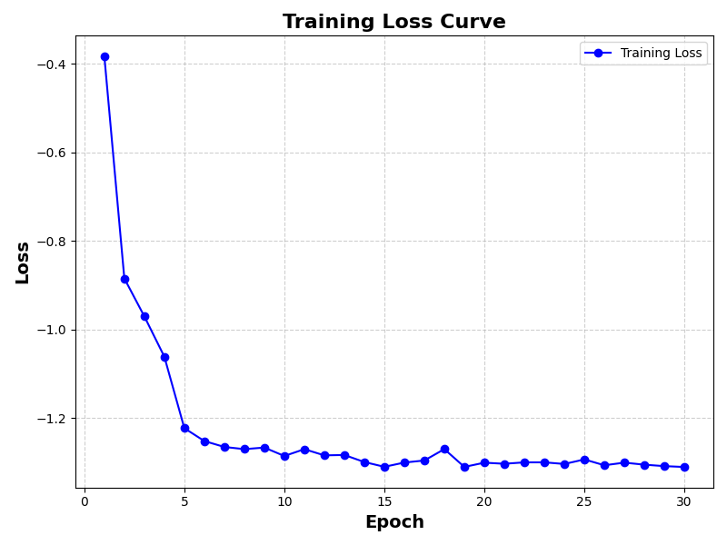

# **Ömer Coşkun | 2024700024**

## **Overview**

The `homework4.py` file was left unchanged, except the collected trajectories were saved to a file named `cnmp_dataset.pkl`.

The `data_loader.py` file is a helper that loads these saved trajectories, randomly shuffles the indices, normalizes the time values, and creates an observation tensor for each sample that can be directly used by our model.

The `train.py` script trains the model, then evaluates it 1000 times using randomly generated observations and queries. It computes the mean squared error (MSE) between the predicted and ground truth values. Finally, it plots the bar charts and the training loss over epochs, as shown below:

### **Training Loss Curve**

### **Error Comparison Bar Plot**

